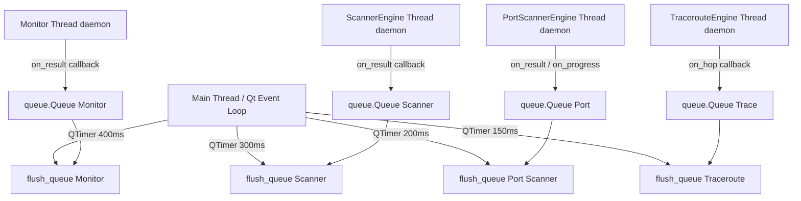

# Architettura

## Struttura directory

```
main.py                          # QApplication entry point
src/
  models.py                      # Tutti i dataclass condivisi
  monitor.py                     # Monitor engine (background thread)
  alerting.py                    # Alerter + AlertConfig
  app_settings.py                # AppSettings — load/save JSON

  engines/                       # Backend puro — zero Qt
    scanner_engine.py            # Discovery IP/subnet (ICMP + ARP)
    port_scanner_engine.py       # TCP port scan
    traceroute_engine.py         # Hop-by-hop traceroute (tracert)
    dns_engine.py                # Forward + reverse DNS
    http_inspector_engine.py     # Headers, status code, timing
    ssl_engine.py                # Certificato SSL/TLS
    whois_engine.py              # Info dominio/IP

  probers/                       # Probe atomici riusabili
    icmp.py                      # subprocess ping → latency
    tcp.py                       # socket.connect_ex()
    http.py                      # requests.get()

  gui/
    main_window.py               # Shell: QTabWidget + banner admin
    panels/
      monitor_panel.py           # Tab Monitor
      scanner_panel.py           # Tab Network Scanner
      port_scanner_panel.py      # Tab Port Scanner
      troubleshoot_panel.py      # Tab Troubleshoot (5 sub-tab)
    widgets/
      host_table.py              # Tabella host monitor
      scan_result_table.py       # Tabella risultati scanner
      port_result_table.py       # Tabella risultati port scan
      history_table.py           # History probe per host
    dialogs/
      add_host_dlg.py            # Dialog aggiungi host
      add_subnet_dlg.py          # Dialog aggiungi range/subnet
      settings_dlg.py            # Dialog alert config

  utils/
    ip_range.py                  # Expand range notazione custom
    privileges.py                # is_admin() + restart_as_admin()

config/
  hosts.txt                      # Lista host (formato testuale)
  settings.json                  # Stato app (auto-salvato alla chiusura)
docs/                            # Questa documentazione
```

---

## Modello di threading



> [!important] Regola fondamentale
> **Nessun tool scrive direttamente sul thread Qt.** Tutti i risultati passano per `queue.Queue` e vengono drenati da `QTimer` sul main thread. Questo evita crash e race condition.

---

## Modelli dati (`models.py`)

### Esistenti (Monitor)

| Classe | Campi chiave | Usata da |
|--------|-------------|---------|
| `HostEntry` | host, probe_type, port, label | Monitor, file hosts.txt |
| `ProbeResult` | host, status, latency_ms, error, timestamp | Monitor engine → tabella |
| `HostStats` | sent, received, min/avg/max latency, loss% | Monitor panel |
| `HostStatus` | UP / DOWN / UNKNOWN | Colorazione tabella |
| `ProbeType` | ICMP / TCP / HTTP | Dispatch probe |

### Nuovi (Toolkit)

| Classe | Campi chiave | Usata da |
|--------|-------------|---------|
| `ScanResult` | ip, hostname, mac, vendor, latency_ms, is_alive | Scanner |
| `PortScanResult` | ip, port, state, service, banner | Port Scanner |
| `TraceHop` | hop, ip, hostname, rtt_ms | Traceroute |
| `DnsResult` | query, a_records, ptr_record, mx_records, cname_record | DNS |
| `SslResult` | host, subject, issuer, expiry, days_remaining, cipher, valid | SSL |
| `HttpInspectResult` | url, status_code, response_time_ms, headers | HTTP Inspector |
| `WhoisResult` | query, registrar, created, expires, name_servers, raw | Whois |

---

## Comunicazione cross-tab

I pannelli comunicano tramite **Qt signals** connessi in `MainWindow`:

```
ScannerPanel.send_to_monitor       → MainWindow._add_host_to_monitor(ip)
ScannerPanel.send_to_port_scanner  → PortScannerPanel.set_target(ip)
ScannerPanel.send_to_traceroute    → TroubleshootPanel.set_traceroute_target(ip)
ScannerPanel.send_to_dns           → TroubleshootPanel.set_dns_target(ip)

MonitorPanel.send_to_port_scanner  → PortScannerPanel.set_target(ip)
MonitorPanel.send_to_traceroute    → TroubleshootPanel.set_traceroute_target(ip)
MonitorPanel.send_to_dns           → TroubleshootPanel.set_dns_target(ip)

PortScannerPanel.add_to_monitor    → MonitorPanel.add_host_tcp(host, port)
```

Click destro su qualsiasi riga → menu contestuale → "Invia a →" attiva il tab di destinazione e pre-compila l'input.

---

## Gestione privilegi

```python
# src/utils/privileges.py
is_admin()         # → bool: controlla IsUserAnAdmin() via ctypes
restart_as_admin() # → ShellExecuteW("runas") + sys.exit(0)
```

Se non admin:
- Banner giallo in cima alla finestra
- ARP scan disabilitato (silent fallback, MAC vuoto)
- Raw ICMP → subprocess ping (già funzionante unprivileged)

---

## Persistenza

| File | Contenuto | Quando |
|------|-----------|--------|
| `config/settings.json` | Ultimo file hosts, intervallo, config alert SMTP/webhook | Salvato alla chiusura, caricato all'avvio |
| `config/hosts.txt` | Lista host nel formato testuale | Caricato manualmente o all'avvio (last_hosts_file) |
