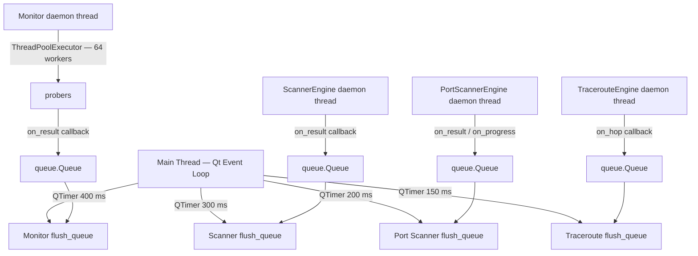

# Architecture

## File structure

```
GLR-ParallelPingInfo/
├── main.py                         # QApplication entry point
├── requirements.txt                # PyQt6 + requests (core)
├── GLR-Network-Toolkit.spec        # PyInstaller build spec
│
├── config/
│   ├── hosts.txt                   # Host list (loaded at startup)
│   └── settings.json              # Persisted app state (auto-saved)
│
├── src/
│   ├── models.py                   # All shared dataclasses + enums
│   ├── monitor.py                  # Monitor: daemon thread + ThreadPoolExecutor
│   ├── alerting.py                 # Alerter + AlertConfig (log/email/webhook)
│   ├── app_settings.py             # AppSettings dataclass, load() / save()
│   │
│   ├── probers/                    # Atomic reusable probes (no Qt)
│   │   ├── base.py                 # AbstractProber (ABC)
│   │   ├── icmp.py                 # subprocess ping → latency_ms
│   │   ├── tcp.py                  # socket.connect_ex() with timeout
│   │   └── http.py                 # requests.get(), measures response time
│   │
│   ├── engines/                    # Background engines (no Qt, daemon threads)
│   │   ├── scanner_engine.py       # IP/subnet discovery (ICMP + optional ARP)
│   │   ├── port_scanner_engine.py  # TCP port scan
│   │   ├── traceroute_engine.py    # Hop-by-hop traceroute (tracert subprocess)
│   │   ├── dns_engine.py           # Forward + reverse DNS lookups
│   │   ├── http_inspector_engine.py# Headers, status code, response time
│   │   ├── ssl_engine.py           # SSL/TLS certificate inspection
│   │   └── whois_engine.py         # Domain / IP info
│   │
│   ├── gui/
│   │   ├── theme.py                # Theme tokens (DARK / LIGHT), apply()
│   │   ├── main_window.py          # Shell: QTabWidget + admin banner
│   │   ├── add_host_dlg.py         # Add host dialog (ICMP / TCP / HTTP)
│   │   ├── add_subnet_dlg.py       # Add range / subnet dialog
│   │   ├── settings_dlg.py         # Alert config + theme selector
│   │   ├── host_table.py           # Monitor host table (QTableWidget)
│   │   ├── history_table.py        # Per-host probe history table
│   │   │
│   │   ├── panels/                 # One panel per tab
│   │   │   ├── monitor_panel.py    # Monitor tab — queue drain, splitter layout
│   │   │   ├── scanner_panel.py    # Network Scanner tab
│   │   │   ├── port_scanner_panel.py
│   │   │   └── troubleshoot_panel.py # 5 sub-tabs (traceroute / DNS / HTTP / SSL / Whois)
│   │   │
│   │   └── widgets/
│   │       ├── latency_chart.py    # QPainter custom latency sparkline
│   │       ├── scan_result_table.py
│   │       └── port_result_table.py
│   │
│   └── utils/
│       ├── ip_range.py             # Expand CIDR and range notation
│       └── privileges.py           # is_admin() + restart_as_admin()
│
└── docs/                           # Obsidian vault (Italian)
```

---

## Threading model

**Rule:** No engine or prober writes to Qt objects directly. Every result goes through `queue.Queue`; a `QTimer` on the main thread drains it.



The Monitor tab runs a `ThreadPoolExecutor` with up to 64 workers — one task per host per cycle. All other engines use a single daemon thread internally.

---

## Data models

### Monitor (core)

| Class | Key fields | Used by |
|-------|-----------|--------|
| `HostEntry` | `host`, `probe_type`, `port`, `label` | Monitor, hosts.txt parser |
| `ProbeResult` | `host`, `status`, `latency_ms`, `error`, `timestamp` | Monitor → table |
| `HostStats` | `sent`, `received`, min/avg/max latency, loss% | Monitor panel |
| `HostStatus` | `UP` / `DOWN` / `UNKNOWN` | Table color-coding, alerts |
| `ProbeType` | `ICMP` / `TCP` / `HTTP` | Probe dispatch |

### Toolkit extensions

| Class | Key fields | Used by |
|-------|-----------|--------|
| `ScanResult` | `ip`, `hostname`, `mac`, `vendor`, `latency_ms`, `is_alive` | Network Scanner |
| `PortScanResult` | `ip`, `port`, `state`, `service`, `banner` | Port Scanner |
| `TraceHop` | `hop`, `ip`, `hostname`, `rtt_ms` | Traceroute |
| `DnsResult` | `query`, `a_records`, `ptr_record`, `mx_records`, `cname_record` | DNS |
| `SslResult` | `host`, `subject`, `issuer`, `expiry`, `days_remaining`, `cipher`, `valid` | SSL |
| `HttpInspectResult` | `url`, `status_code`, `response_time_ms`, `headers` | HTTP Inspector |
| `WhoisResult` | `query`, `registrar`, `created`, `expires`, `name_servers`, `raw` | Whois |

---

## Signal wiring (cross-tab)

All signals are wired in `MainWindow.__init__()`.

```
MonitorPanel.status_changed      → statusBar().showMessage()
MonitorPanel.theme_changed       → MainWindow._on_theme_changed()
MonitorPanel.send_to_port_scanner → PortScannerPanel.set_target()
MonitorPanel.send_to_traceroute  → TroubleshootPanel.set_traceroute_target()
MonitorPanel.send_to_dns         → TroubleshootPanel.set_dns_target()

ScannerPanel.send_to_monitor     → MainWindow._add_host_to_monitor()
ScannerPanel.send_to_port_scanner → PortScannerPanel.set_target()
ScannerPanel.send_to_traceroute  → TroubleshootPanel.set_traceroute_target()
ScannerPanel.send_to_dns         → TroubleshootPanel.set_dns_target()

PortScannerPanel.add_to_monitor  → MonitorPanel.add_host_tcp()
```

---

## Theme system

`src/gui/theme.py` owns all visual tokens.

```python
@dataclass(frozen=True)
class Theme:
    name: str
    bg: str; surface: str; border: str; text: str; ...
    up_bg: str; up_fg: str; down_bg: str; down_fg: str; ...
    chart_bg: str; chart_line: str; chart_dot: str; ...

DARK  = Theme(name="dark",  bg="#1e1e2e", ...)
LIGHT = Theme(name="light", bg="#ffffff", ...)

def current() -> Theme: ...           # read current theme anywhere
def apply(app, t: Theme) -> None: ... # set QSS + update _current
```

Widgets that can't be styled with QSS alone (`LatencyChart`, `HistoryTable`) call `theme.current()` in `paintEvent()` / `refresh_theme()`. The theme is saved to `settings.json` and restored on startup.

---

## Settings persistence

`AppSettings` is a frozen dataclass that serializes to / from `config/settings.json`:

- Loaded in `MainWindow.__init__()` before any widget is constructed
- Saved in `MainWindow.closeEvent()` after `MonitorPanel.save_settings()` runs
- The theme is applied before widget construction so the first paint is already correct
